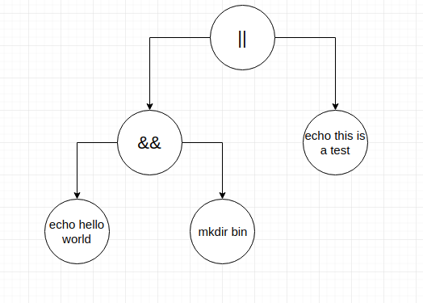

# rshell-wizard

<h2 id="Overview">Overview</h2>

<h3 id="Introduction">Introduction</h3>
Run multiple PATH executables with success and failure logic connectors between executables alongside commenting. Further determine whether a given PATH exists by using specific flags.

<h3 id="Getting Started">Getting Started</h3>
The usage is intuitive. Once you are in the main directory, execute "make" which will create an executable that is located in the "bin" directory called "rshell."

<h3 id="Syntax">Syntax</h3>

<h4 id="Logic Connectors">Logic Connectors</h4>
If you desire to add logic connectors in your executables, then use "&&", "||", and ";" between commands. For example:

    $ mkdir bin && echo Created new directory
    
will attempt to create the directory bin and will only execute the echo command if the previous command executed successfully. Likewise:

    $ mkdir bin || echo Directory already exists.
    
will attempt to create the directory bin; however, the echo will only execute if the previous command failed.

    $ mkdir bin; echo Directory already exists.
    
will attempt to create directory, and it will then execute the following command regardless if the prior command failed or succeeded.

There are no limits to the number of commands that can be chained using these and any other connectors.

<h4 id="Parentheses">Parentheses</h4>
Now with the introduction of precedence operators by using parentheses (), this will change the precedence of the returns of commands, connectors, and chains of connectors:
For example:

    $ mkdir bin && echo A bin directory has been created || mkdir newbin && echo A new bin directory has been created

Can be manipulated with precdence operators such as:

    $ (mkdir bin && echo A bin directory has been created) || (mkdir newbin && echo A new bin directory has been created)
    
If the first set of parentheses returns true via the AND connector, then the OR connector's right expression, which is now condensed into a group via parentheses, will not be executed. Otherwise, if the first set of parentheses returns false, then the right expression of the OR connector will be executed.

<h4 id="Special Commands">Special Commands</h4>
If you want to exit out of the rshell, "exit" will terminate the program. For example:

    $ echo hello world; exit; mkdir bin

Afer the first command executes, "exit" will be encountered by the rshell, which will then terminate the program, and thus disregarding anything that comes after.

Next, if you want to use an equivalent terminal command of "test", "[ ]" should be explicitly used around the command itself. For example:

    Both are equivalent!
    $ test -e /home/user/Documents
    $ [ -e /home/user/Documents ]

This will display to the console "(True)" if the directory exists, or it will display "(False)" to the console if it does not exist.

<h4 id ="Commenting">Commenting</h4>
Documentation is very important, so you are able to add comments into your command lines.

    These are same!
    $ mkdir test; rm ./test #Testing mkdir and rm; echo hello
    $ mkdir test; rm ./test
    
Everything after the '#' will not be included in the arguments and such, will not interfere with your executables.

<h2 id="How it works">How it works</h2>
Our rshell stores the commands in a binary tree like so:

Now if parentheses are included in the commands, then the binary tree would look like:

<h2 id="Debugging">Debugging</h2>
Debugging should go here.

<h2 id="Known Bugs">Known Bugs</h2>

The program is currently a work in progress, so there will be bugs sadly. 

List of known bugs:
    With bash piping, empty commands will not create a newline. Unsure if this is a bash issue or a coding issue.
